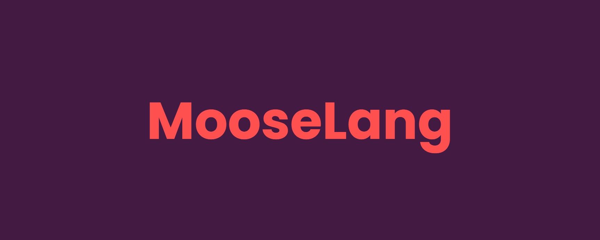

## (WIP) Functional programming language implemented with call-by-push-value semantics.
A functional programming language with support for static types, continuations, typed effects, and effect handlers.
A lower level call-by-push-value representation is utilized, offering fine-grain control over program semantics.

##### Table of Contents
[Description](#description)  
[Features](#features)  
[Roadmap](#iteration-4-current)  
[User Instructions](#user-instructions)  
[Known Issues](#known-issues)

<a name="table-of-contents-headers"></a>

## Description
This is a personal exploration into creating a functional programming language.
Namely, a language which compiles into a simpler call-by-push-value (CBPV) representation,
which is then evaluated.

CBPV subsumes call-by-name and call-by-value,
allowing for both semantics to be represented by one language.
This yields a fine-grain control of program semantics allowing for interesting typing, compilation, and execution strategies.

As development of this language continues, more quality of life and higher-level language features will be included.
During the early stages, more focus will be spent solidifying the lower-level CBPV representation.

References to Paul Blain Levy's work (creator of CBPV):
- His [extended abstract](https://www.cs.bham.ac.uk/~pbl/papers/tlca99.pdf); a short document giving an overview of CBPV, how it relates to CBN and CBV, and semantics.
- His [thesis](https://www.cs.bham.ac.uk/~pbl/papers/thesisqmwphd.pdf) on CBPV; a long document describing CBPV in depth and the corresponding denotational/operational semantics.
- His [tutorial slides](https://www.cs.bham.ac.uk/~pbl/papers/cbpvefftt.pdf) on the topic.

## Features
- Auto-curried functions
- Lambda expressions
- Let-in expressions
- Basic types (Number, String, Unit)
- Typed and executable CBPV IR
- Save and load CBPV IR

## Example
The following high-level syntax:
```
let w =
    let x = 3 in
    let y = \z: Number -> x + z in
        y 7
in
    w + 5
```
Is compiled into the following low-level CBPV IR:
```
do (
    let x = 3.0 in
    let y = #thunk (\z: Number ->
        do (
            #push x
            #force +
        ) = __app_0
        in
        #push z
        #force __app_0
    ) in
    #push 7.0
    #force y
) = w
in
do (
    #push w
    #force +
) = __app_1
in
#push 5.0
#force __app_1
```
Which, when executed, produces the value 15.0 of type Number.

## Roadmap
### Iteration 1 (Complete)
- Frontend parser combinator.
  - Parsing complex expressions (with infix operators) via modified operator-precedence algorithm.
- AST representation of syntactic components.

### Iteration 2 (Complete)
- Typing of expressions (according to CBPV typing rules).
- Intermediate Representation (IR) implementation of CBPV lambda calculus.
  - let bindings, force, thunk, lambda, push, produce

### Iteration 3 (Complete)
- Interpreter to execute CBPV IR directly.
  - Correctly execute canonical CBPV example.
  - Operand stack supporting frames (let-computation bindings).
  - Support for builtins.

### <u>Iteration 4 (Current)</u>
- Refine front-end syntax
  - Global definitions
  - Operator precedence and associativity
- Tuples and tuple pattern matching.
- Simple type pattern matching.
- Interpreter to execute front-end syntax.
- Parser for CBPV IR syntax.
- Implement REPL with interpreter.

### Iteration 5 (Proposed)
- Define sum types with tags.
- Support for product types with pattern matching.
- Support for sum types with pattern matching.
- More robust user data type capabilities
  - Nested value deconstruction
    - Pattern match and function arguments
  - Records?
  - Explicit typing of expressions?

### Iteration ? (Exploration)
- Static typing system:
  - Structural, nominal, refined, generics?
- Polymorphism mechanism:
  - Ad-hoc, parametric, subtyping?
- Dispatch mechanism:
  - Single, multiple, universal, overloading?
- Recursive function/data definitions.
- Implement sum and products in terms of Jumbo Calculus.

## User Instructions
Coming soon once interpreter and CLI are finished.

Built with Java SDK 18.

## Known Issues
- Chain operator `;` is parsing slightly incorrectly, requiring unnecessary parentheses for complex chains.
